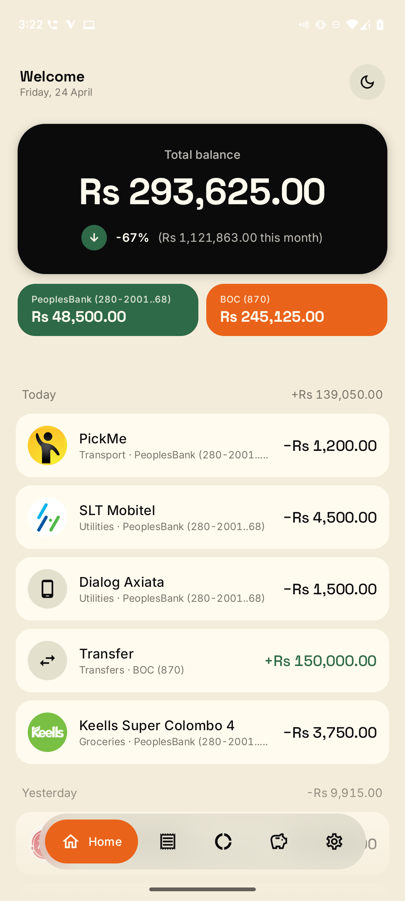
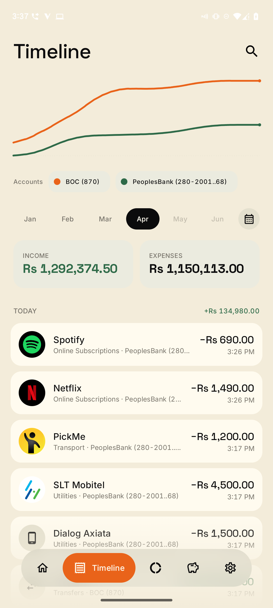
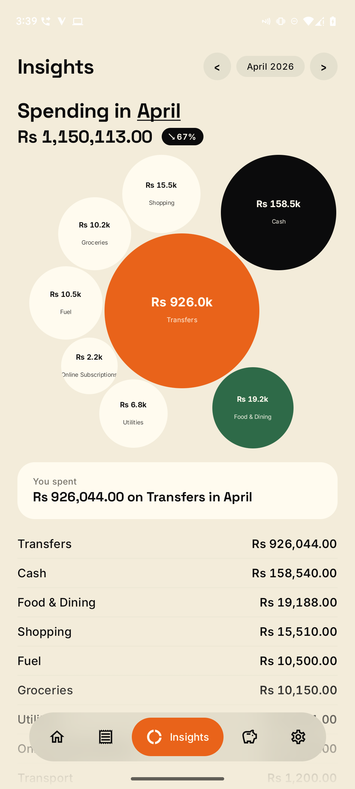
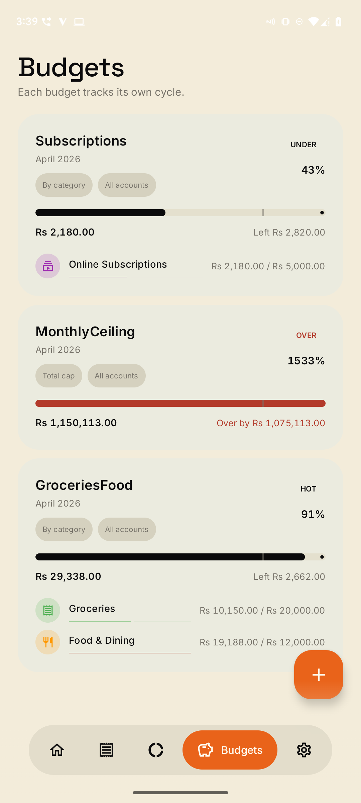

# Salli

**සල්ලි** — Android-native, 100% on-device SMS expense tracker for Sri Lanka.

Salli reads your bank SMS, parses transactions locally, and shows you where your money went. Nothing leaves the phone — no backend, no account, no telemetry.


<p>
  
  
  
  
</p>

## What it does

- **Auto-log** every bank SMS the moment it arrives. No manual entry.
- **Balance** tracked per account, updated from each SMS's reported balance.
- **Categories** auto-assigned by keyword (Keells → Groceries, Uber → Transport) and transaction type (ATM → Cash, CEFT → Transfers).
- **Insights** — donut chart of category spend + per-category breakdown. Date-range picker lets you look at any period.
- **Budgets** — monthly cap per category with a live progress bar.
- **Top Spenders** on Home — "Where your money went this month" at a glance.
- **Timeline** — all transactions grouped by day with daily totals, income vs expense pills, search.
- **Transfer detection** — when a debit on one of your accounts matches a credit on another within 48h, they're paired into a single transfer and excluded from income/expense totals.
- **Fee extraction** — PeoplesBank debit + Fund Transfer confirm SMS get merged into one row with the fee (the difference) shown inline.
- **Unknown SMS queue** — bank messages Salli can't parse show up in a triage list so you can see what's missing.
- **Export** — your full transaction history as CSV, your device.
- **Delete** — wipe everything at any time with a single tap. No dark patterns.

## Why on-device

Salli does all of the above without ever touching the network. SMS parsing runs entirely on your phone via regex templates, so your bank alerts never leave the device — no backend to trust, no account to sign up for, no telemetry to opt out of.

## Bank coverage (v1)

Coverage is honest: just because a sender is recognised doesn't mean every SMS shape that bank sends is parsed. Unknown shapes land in the Unknown SMS queue for triage.

| Bank | Sender | Coverage |
|---|---|---|
| Bank of Ceylon | `BOC` | **Full** — ATM withdraw / CDM deposit, cheque deposit, online transfer (debit + credit), CEFT transfer (debit + credit), ACH clearing |
| People's Bank | `PeoplesBank` | **Full** — POS / CDM / ATM debits + credits, mobile payment, fund transfer confirm, bill payment, QR payment |
| Commercial Bank | `COMBANK` | **Partial** — debit-card purchase (LKR + FX) and declined attempts only. Transfers / ATM / CDM / bill payments / incoming credits not yet supported — samples needed |

Queued once samples land: Sampath, HNB, NTB, DFCC, Seylan, Amana, NDB, HSBC, Standard Chartered.

Contributing SMS samples — from your current ComBank account or from any unsupported bank — is the single biggest way to help. See [docs/BANK_SAMPLES_GUIDE.md](docs/BANK_SAMPLES_GUIDE.md).

## Install

### F-Droid (recommended)

*(Coming soon once the fastlane metadata PR is accepted.)*

### Installing without Play Store

Salli ships outside the Play Store, so a few install methods avoid Android's sideload friction better than others. Ranked from least to most hassle:

**Obtainium (recommended).** Obtainium is an OSS app that installs apps from GitHub releases using Android's session-based installer. Because Android exempts session-based installers from the Android 15 SMS permission lockout, grants just work. It also handles updates automatically. [Get Obtainium from F-Droid](https://f-droid.org/packages/dev.imranr.obtainium.fdroid/), add Salli's GitHub URL, done.

**F-Droid.** Once Salli is published on F-Droid, installing via the F-Droid client (especially with the Privileged Extension) bypasses the lockout the same way. [F-Droid listing coming.]

**ADB.** For developers: `adb install -r app-debug.apk` installs as the shell package, which is also exempt from the lockout.

**Direct APK download.** Download the APK from the [Releases](../../releases) page and tap to install. This is the friction-heavy path — Play Protect flags the install, and Android 15+ silently blocks SMS permission requests until you manually unlock. If you go this route:

1. Long-press Salli on your home screen → **App info**
2. Tap the **⋮** menu at the top right → **Allow restricted settings**
3. Re-open Salli and tap **Try again** on the permission screen

The onboarding + Settings permission tiles detect this case and surface the same steps inline with a shortcut to the right system page.

### Build from source

```bash
git clone https://github.com/leadsgen-tech/salli
cd salli
./gradlew :app:installDebug
```

Android Studio Ladybug or later. JDK 17. No special setup — no env vars, no API keys.

## How it works

```
SMS arrives
    ↓ RECEIVE_SMS BroadcastReceiver
    ↓ WorkManager job (SmsIngestWorker)
    ↓ SmsParser.parse → ParseResult
        ├── Otp             → discard
        ├── Informational   → log, discard
        ├── Unknown         → surface in Unknown SMS queue
        └── Success(tx)
             ↓ DuplicateDetector
             ↓ PeoplesBankMerger (folds debit+confirm pairs)
             ↓ InternalTransferDetector (pairs cross-bank transfers)
             ↓ KeywordCategorizer → TypeCategorizer fallback
             ↓ upsert account
             ↓ insert transaction
             ↓ refresh cached balance (atomic SQL)
```

Architecture:

- `:domain` — pure-Kotlin value types (Money, ParseMode, TransactionFlow, etc.). Kotlin Multiplatform-ready when we cross that bridge.
- `:parser` — pure-Kotlin SMS → Transaction regex pipeline. Per-bank templates in `parser/templates/`. No Android deps.
- `:data` — Room DAOs, repositories, ingest orchestration, SMS importer.
- `:design` — Material 3 theme, shared components (AccountCard, DonutChart, DateRangeSelector, TransactionRow).
- `:app` — Android-only: Activity, WorkManager, screens, ViewModels, DI.

## Privacy, for real

- **No `INTERNET` permission used** unless you opt into the (currently parked) AI mode, which downloads a model once and then runs entirely offline.
- **No analytics SDK in the dependency graph.** CI fails if `firebase|mixpanel|analytics|crashlytics` appear in `libs.versions.toml`.
- **No cleartext network ever.** All app network goes through the single HTTPS URL in `LocalModel.kt` (parked behind the feature flag).
- **No accounts.** The app never asks you to sign in, and has no code to do so.
- **Your data is yours.** Delete-all-data wipes every row on the device. Export gives you a CSV you own.

## Contributing

Bank template expansion is the single biggest way to help. If your bank isn't supported yet, grab 3–5 real SMS from your inbox, redact per [CONTRIBUTING.md](CONTRIBUTING.md), and open an issue — the contribution flow turns them into regex.

Bug reports, UI improvements, categorization-keyword additions, translations — all welcome.

## Licence

Apache 2.0 — see [LICENSE](LICENSE).

Bank and merchant logos in `assets/` remain trademarks of their respective owners. They're used only to visually identify accounts and transactions in the app, equivalent to linking to each bank's own website.
