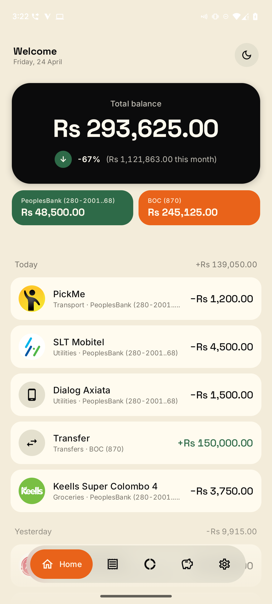
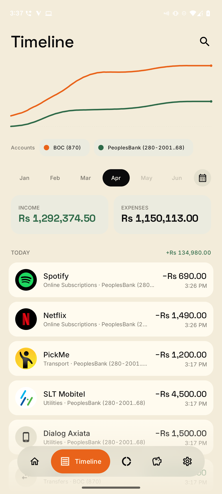
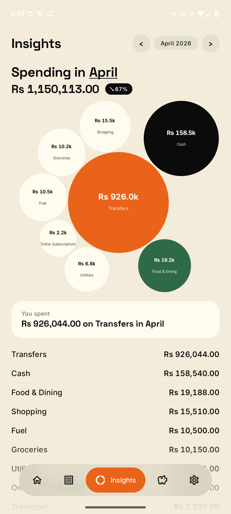
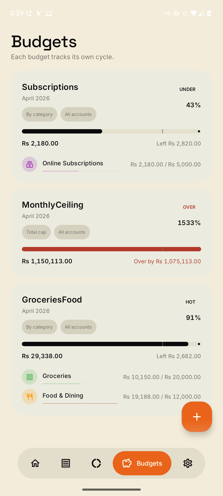

# Salli

**සල්ලි** — Android-native, 100% on-device SMS expense tracker for Sri Lanka.

Salli reads your bank SMS, parses transactions locally, and shows you where your money went. Nothing leaves the phone — no backend, no account, no telemetry.


<p>
  
  
  
  
</p>

## What it does

- **Auto-log** every bank SMS the moment it arrives. No manual entry.
- **Balance** tracked per account, updated from each SMS's reported balance.
- **Categories** auto-assigned by keyword (Keells → Groceries, Uber → Transport) and transaction type (ATM → Cash, CEFT → Transfers).
- **Insights** — donut chart of category spend + per-category breakdown. Date-range picker lets you look at any period.
- **Budgets** — monthly cap per category with a live progress bar.
- **Top Spenders** on Home — "Where your money went this month" at a glance.
- **Timeline** — all transactions grouped by day with daily totals, income vs expense pills, search.
- **Transfer detection** — when a debit on one of your accounts matches a credit on another within 48h, they're paired into a single transfer and excluded from income/expense totals.
- **Fee extraction** — PeoplesBank debit + Fund Transfer confirm SMS get merged into one row with the fee (the difference) shown inline.
- **Unknown SMS queue** — bank messages Salli can't parse show up in a triage list so you can see what's missing.
- **Bills & Fuel Pass** — SLT-MOBITEL bill SMS (issued, reminders, overdue, payment received) become a to-pay list with due dates and a "due in N days" reminder you can tune; Dialog postpaid, CEB and Water Board shapes are provisional until real samples land. National Fuel Pass confirmations from 1919 show each vehicle's weekly quota left, whether today is its odd/even eligible day, and a last-chance reminder before the quota resets. Both live under Settings → Trackers.
- **Export** — your full transaction history as CSV, your device.
- **Delete** — wipe everything at any time with a single tap. No dark patterns.

## Why on-device

Salli does all of the above without ever touching the network. SMS parsing runs entirely on your phone via regex templates, so your bank alerts never leave the device — no backend to trust, no account to sign up for, no telemetry to opt out of.

## Bank coverage (v1)

Only what we've actually parsed from real samples ships. Anything else a bank sends lands in the Unknown SMS queue for triage — it's how we find out what's missing.

### Bank of Ceylon — sender `BOC`

**Covered**
- ATM withdrawal
- ATM / CDM cash deposit
- Cheque deposit (credit)
- Online transfer — debit + credit
- CEFT transfer — debit + credit
- Generic "Transfer Credit / Debit"
- ACH clearing
- Cash cheque debit (`Cash Cheque Debit CHQ/NO …`)

### People's Bank — sender `PeoplesBank`

**Covered**
- Card purchase (POS)
- ATM withdrawal, CDM cash deposit, branch cash payment
- LPAY / PeoPAY / Just Pay mobile transfers
- Fund transfer (the two-SMS pair — debit + confirm — is merged into one row with the fee surfaced)
- Bill payment
- QR payment
- Cash deposit (`Cash Depo.`), inward e-remittance (`eRem Payment`), Just Pay debits and `(Reversal)` credits
- Login, device-change and tax-declaration notices are recognised and dropped

### Commercial Bank — senders `COMBANK`, `ComBank_Q+`

Card-level SMS come from `COMBANK`; account-level SMS (generated by the ComBank Q+ mobile app) come from `ComBank_Q+`. Single template handles both.

**Covered**
- Debit-card purchase (LKR and foreign currency)
- Declined card attempts (flagged separately, not counted as spend)
- ATM withdrawal via card
- Account credit (`Credit for Rs. X to <account> … at DIGITAL BANKING DIVISION`)
- CRM deposit (`We wish to confirm a CRM Deposit …`)
- Dormant-account reminder (recognised and dropped)
- Daily-limit declines and cancellations without an amount (recognised and dropped)

**Not yet covered** — bill payments, outgoing interbank transfers, cheque clearance.

### Hatton National Bank — sender `HNB`

**Covered**
- Account debit / credit (Mobile Banking transfers, CEFT credits)
- Fee / alert-charge debits
- Card purchase (LKR and foreign currency; FX rows drop the balance because we'd otherwise mix currencies)
- ATM withdrawal with explicit transaction fee
- "You received LKR X from …" payment notices (recognised and dropped: the money arrives in your own bank's SMS)
- Credit-card alert (`… (Apprx) LKR …`) — *provisional, reconstructed format*

**Not yet covered** — bill payments, cheque clearance, standing orders, card declines. Likely-covered-by-current-regex but unverified: inward CEFT/SLIPS credits beyond the samples we've seen.

### Seylan Bank — senders `SEYLAN`, `SEYLANBANK`

**Covered**
- Card purchase (POS)
- ATM withdrawal at other banks' ATMs (Peoples Bank / HNB / ICBS / Offsite / CRM — heuristically classified from the merchant text)
- Card annual fees

**Not yet covered** — everything account-side (transfers, deposits, incoming credits). Samples from a Seylan current account would unlock this.

### Amana Bank — sender `AMANABANK`

**Covered**
- POS card purchase
- Inward CEFT transfer (incoming credit, with payer + reference)
- Outbound IB CEFT transfer (outgoing debit, transfer fee tracked separately)
- Savings profit distribution (Islamic-banking interest equivalent, tagged as income)

**Not yet covered** — ATM, CDM, bill payments, mobile-wallet transfers. Needs more sample variety.

---

### Provisional — Sampath, DFCC, NDB, NTB, Pan Asia, People's Card

These templates exist and have tests, but the tests run on **reconstructed** messages, not
real samples. They were written from publicly observable format evidence (the sender IDs and
field wording those banks use) so that early adopters get transactions logged instead of
nothing. Field-anchored extraction means a body missing the essentials lands in the Unknown
queue rather than becoming a wrong transaction.

| Bank | Senders | Shapes |
|---|---|---|
| Sampath | `SAMPCCTXN`, `SAMPATHTXN` | Credit-card authorisation; account debit/credit incl. Vishwa transfers |
| DFCC | `DFCC Info`, `DFCC Alerts` | Credit-card debit/credit; account debit/credit |
| NDB | `NDB CARD`, `NDB ALERTS` | Card debit/credit; statement notices dropped |
| NTB | `NationsSMS` | Card purchase; CEFTS transfer; declines dropped |
| Pan Asia | `PanAsiaBank` | Credit-card authorisation |
| People's Bank cards | `PeoplesCard` | Card purchase |

If you bank with one of these, 3–5 redacted real messages promote it to verified — see
[docs/BANK_SAMPLES_GUIDE.md](docs/BANK_SAMPLES_GUIDE.md).

### Queued (sender recognised, no template)

NSB, HSBC, Standard Chartered, Cargills Bank, CDB and Union Bank messages go straight to the
Unknown SMS queue so you can report the format from inside the app. Contributions are
anonymous; maintainers do the regex work.

## Install

### F-Droid (recommended)

*(Coming soon once the fastlane metadata PR is accepted.)*

### Installing without Play Store

Salli ships outside the Play Store, so a few install methods avoid Android's sideload friction better than others. Ranked from least to most hassle:

**Obtainium (recommended).** Obtainium is an OSS app that installs apps from GitHub releases using Android's session-based installer. Because Android exempts session-based installers from the Android 15 SMS permission lockout, grants just work. It also handles updates automatically. [Get Obtainium from F-Droid](https://f-droid.org/packages/dev.imranr.obtainium.fdroid/), add Salli's GitHub URL, done.

**F-Droid.** Once Salli is published on F-Droid, installing via the F-Droid client (especially with the Privileged Extension) bypasses the lockout the same way. [F-Droid listing coming.]

**ADB.** For developers: `adb install -r app-debug.apk` installs as the shell package, which is also exempt from the lockout.

**Direct APK download.** Download the APK from the [Releases](../../releases) page and tap to install. This is the friction-heavy path — Play Protect flags the install, and Android 15+ silently blocks SMS permission requests until you manually unlock. If you go this route:

1. Long-press Salli on your home screen → **App info**
2. Tap the **⋮** menu at the top right → **Allow restricted settings**
3. Re-open Salli and tap **Try again** on the permission screen

The onboarding + Settings permission tiles detect this case and surface the same steps inline with a shortcut to the right system page.

### Build from source

```bash
git clone https://github.com/leadsgen-tech/salli
cd salli
./gradlew :app:installDebug
```

Android Studio Ladybug or later. JDK 17. No special setup — no env vars, no API keys.

## How it works

```
SMS arrives
    ↓ RECEIVE_SMS BroadcastReceiver
    ↓ WorkManager job (SmsIngestWorker)
    ↓ SmsParser.parse → ParseResult
        ├── Otp             → discard
        ├── Informational   → log, discard
        ├── Unknown         → surface in Unknown SMS queue
        └── Success(tx)
             ↓ DuplicateDetector
             ↓ PeoplesBankMerger (folds debit+confirm pairs)
             ↓ InternalTransferDetector (pairs cross-bank transfers)
             ↓ KeywordCategorizer → TypeCategorizer fallback
             ↓ upsert account
             ↓ insert transaction
             ↓ refresh cached balance (atomic SQL)
```

Architecture:

- `:domain` — pure-Kotlin value types (Money, TransactionFlow, TransactionType, FuelPassRules, etc.). Kotlin Multiplatform-ready when we cross that bridge.
- `:parser` — pure-Kotlin SMS → Transaction regex pipeline. Per-bank templates in `parser/templates/`. No Android deps.
- `:data` — Room DAOs, repositories, ingest orchestration, SMS importer.
- `:design` — Material 3 theme, shared components (AccountCard, DonutChart, DateRangeSelector, TransactionRow).
- `:app` — Android-only: Activity, WorkManager, screens, ViewModels, DI.

## Privacy, for real

- **No `INTERNET` permission, full stop.** The manifest does not declare it, so the app cannot open a socket even if a bug wanted to. CI fails if it ever reappears.
- **No analytics SDK in the dependency graph.** CI fails if `firebase|mixpanel|analytics|crashlytics|posthog|sentry` appear in `libs.versions.toml`.
- **No AI mode.** An on-device model was prototyped and removed: it needed a network download and prebuilt binaries F-Droid cannot build from source. Regex templates only.
- **No accounts.** The app never asks you to sign in, and has no code to do so.
- **Your data is yours.** Delete-all-data wipes every row on the device. Export gives you a CSV you own.

## Contributing

Bank template expansion is the single biggest way to help. If your bank isn't supported yet, grab 3–5 real SMS from your inbox, redact per [CONTRIBUTING.md](CONTRIBUTING.md), and open an issue — the contribution flow turns them into regex.

Bug reports, UI improvements, categorization-keyword additions, translations — all welcome.

## Licence

Apache 2.0 — see [LICENSE](LICENSE).

Bank and merchant logos in `assets/` remain trademarks of their respective owners. They're used only to visually identify accounts and transactions in the app, equivalent to linking to each bank's own website.
